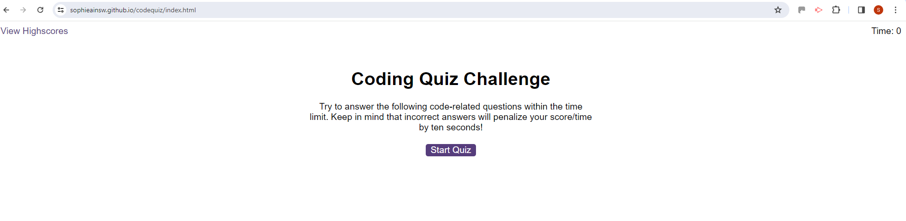
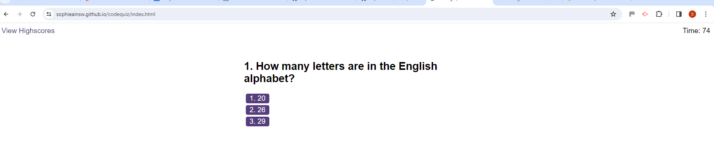
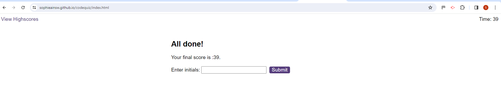
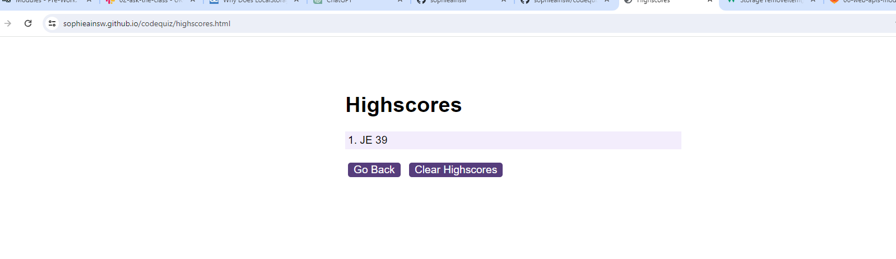

# codequiz

For this activity I have created a timed quiz using Javascript fundamentals.
This quiz stores the highscores from previous users and can be seen in the highscores page.
The questions contai buttons for each answer, 15 seconds are taken off the time if an incorrect answer is pressed and then it moves onto the next questions.

The score given is how many seconds are left when you have answered all the questions.

I used local storage to save this data and then displayed it on the highscore page along with the users input of their intials.

